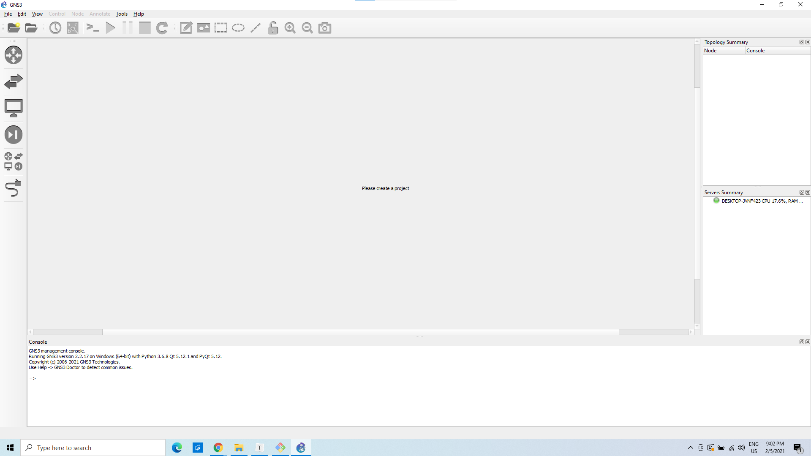
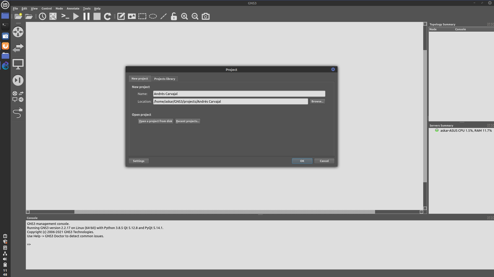
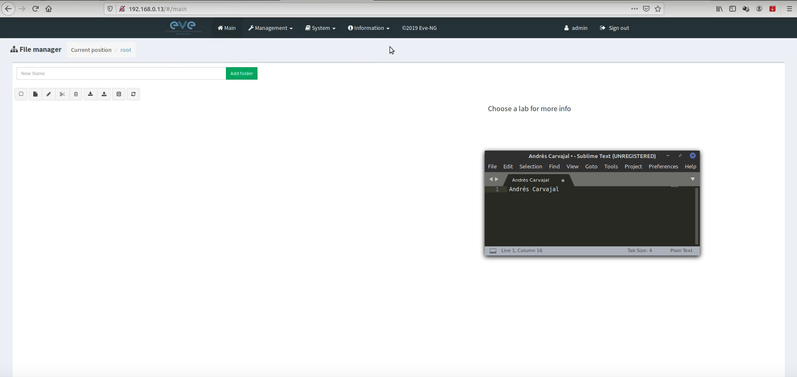

# Instalaciones

* Andrea Vicente - 201404104
  * 
  * foto2
* Andrés Carvajal - 201612272
  * 
  * 
* Samuel
  * foto1
  * foto2

### Componentes Importantes

1. **VPC**: es un ordenador virtual que funciona como punto de inicio y finales de las transferencias de datos, estos poseen una dirección de IP única, que puede ser asignada manualmente o automáticamente.
2. **Cloud**: permite conectar router a la nube, es muy útil cuando se desea conectar a una computadora que no esta en una red.
3. **Ethernet switch**:  dispositivo de interconexión, se usa para conectar varios equipos en red, para hacer una red de área local (LAN).
4. **Router**:  también conocido como enrutador, permite interconexión entre computadoras,  se encarga de definir la ruta a la que se destinara cada paquete de datos, en una red.
5. **Etherswitch router**:  permiten la interconexión de varias LANs en modalidad de conmutación, combinada de paquetes y circuito pero al mismo tiempo mantienen las interfaces, prácticamente es una mezcla entre un switch y un router 
6. **Link**: permite la conexión entre componentes. 

