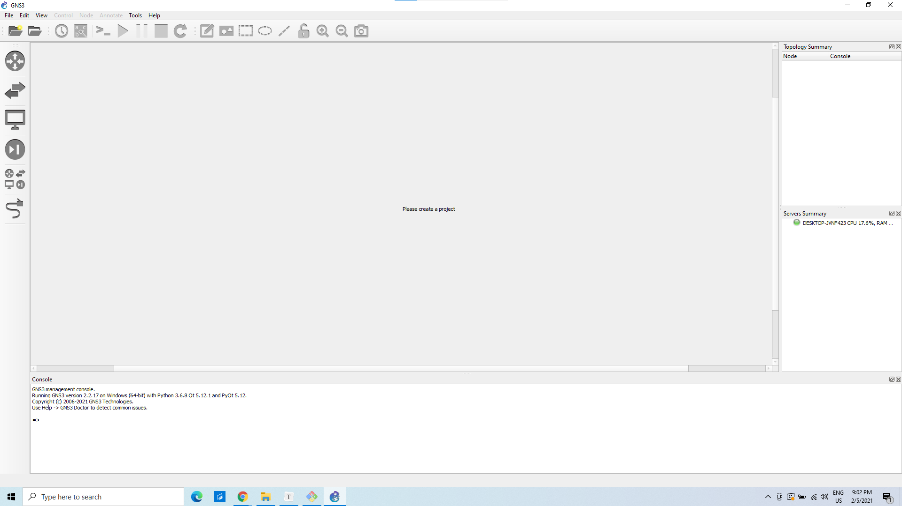

# REDES DE COMPUTADORAS 2

## PRACTICA 1

Investigación desarrollando los temas y/o resolviendo las siguientes preguntas:

 ● ¿Qué es un Simulador / Emulador de red?

Es una herramienta de software que proporciona un entorno para realiar pruebas para nuevos sistemas de redes, es una manera segura de realizar pruebas para nuevos metodos antes de su implemantacion.

● ¿Cuáles son los principales emuladores de red? (Mínimo 3 emuladores) 

    1. Packet Tracer
    2. NetSim
    3. Cisco Virtual Internet Routing Lab
    4. gns3

● ¿Cuáles son las ventajas y desventajas de usar un simulador de red para diseñar topologías? (Mínimo 6 ventajas y 6 desventajas).

Ventajas 

    - Permite realizar simulaciones para revisar posibles fallos 
    - Probar la funcionalidad antes de invertir
    - Permite visualizar de mejor manera las conexiones
    - Permite un trabajo más limpio y efectivo en un entorno controlado
    - Posibilidad de tener etiquetas editables para los componentes
    - Permite optimizar la utilización de los componentes, en comparación si se compran de primero

Desventajas

    - Al ser un entorno controlado no se pueden tomar en cuenta factores externos
    - No puede tenerse en cuenta la distancia entre un componente y otro para corroborar si son efectivas las conexiones
    - En un simulador no se toma en cuenta el costo de los componentes o la disponibilidad de los mismos en la vida real
    - Requiere un conocimiento previo de los emuladores para poder utilizarlos
    - No se tiene exactamente los mismos componentes terminales (las computadoras físicas) que los que se van a usar en la vida real
    - Algunos emuladores limitan el uso de cables a un solo tipo

● ¿Qué es Eve-NG? Sus ventajas y desventajas (Mínimo 6 ventajas y 6 desventajas)

Eve-ng es un emulador de redes en linea, que sirve para emular redes, seguridad y devOps

Ventajas 

    - Simple
    - Rapido
    - Accesible por estar en la red
    - Trabajo en equipo mas facil
    - 

Desventajas

    - Solo es accesible en linea
    - Complica un poco la instalación
    - No es una aplicación como tal, es un cliente en línea
    - 

● ¿Que es GNS3? Sus ventajas y desventajas (Mínimo 6 ventajas y 6 desventajas).

Es un software open source, que simula redes ya sea desde diseño de redes simples a complejas, se acerca bastante al funcionamiento real de redes.  Este software proporciona interfaz gráfica, para el diseño de y configuración de redes, las simulaciones que se pueden llegar hacer con este software pueden ser bastante completas y precisas, ya que permite ejecutar emuladores como, VirtualBox, VMware o Qemu para ejecutar diferentes sistemas operativos.        

Ventajas:        

1. Es open source
2. Permite ejecutar con o sin hipervisores
3. Tiene una comunidad bastante grande y activa
4. No tiene limitaciones de la cantidad de dispositivos permitidos en la redes que se crean
5. Admite imagines VIRL
6. Tiene soporte nativo en linux
7. Es multiplataforma 

Desventajas:

1. Depende de el hardware, en el que se ejecuta el GNS3, ya que se podría ver limitado por la ram.
2. Las imágenes de Cisco, se deben descargar, no vienen incluidas.
3. Necesita instalación local del software
4. Se puede ver afectado por la configuración del hardware local. 
5. No se puede ejecutar en un contenedor, se debe instalar directamente en el sistema
6. No se puede probar ni medir la performance de la infraestructura real de red 

● Principales diferencias entre GNS3 y Eve-NG, además, ¿En qué situación es
mejor utilizar cada uno?

1. GNS3 es mas amigable
2. Eve-NG es para entornos empresariales con recursos mucho más grandes
3. Eve-NG es más potente
4. GNS3 tiene una gran comunidad de colaboradores activos
5. Eve-NG su interfaz es web
6. GNS3 es más básico

### Instalación GNS3-EVE

- Andrea Vicente - 201404104

* Andrés Carvajal - 201612272

### Componentes importantes:

1. **VPC**: es un ordenador virtual que funciona como punto de inicio y finales de las transferencias de datos, estos poseen una dirección de IP única, que puede ser asignada manualmente o automáticamente.
2. **Cloud**: permite conectar router a la nube, es muy útil cuando se desea conectar a una computadora que no esta en una red.
3. **Ethernet switch**:  dispositivo de interconexión, se usa para conectar varios equipos en red, para hacer una red de área local (LAN).
4. **Router**:  también conocido como enrutador, permite interconexión entre computadoras,  se encarga de definir la ruta a la que se destinara cada paquete de datos, en una red.
5. **Etherswitch router**:  permiten la interconexión de varias LANs en modalidad de conmutación, combinada de paquetes y circuito pero al mismo tiempo mantienen las interfaces, prácticamente es una mezcla entre un switch y un router 
6. **Link**: permite la conexión entre componentes. 

